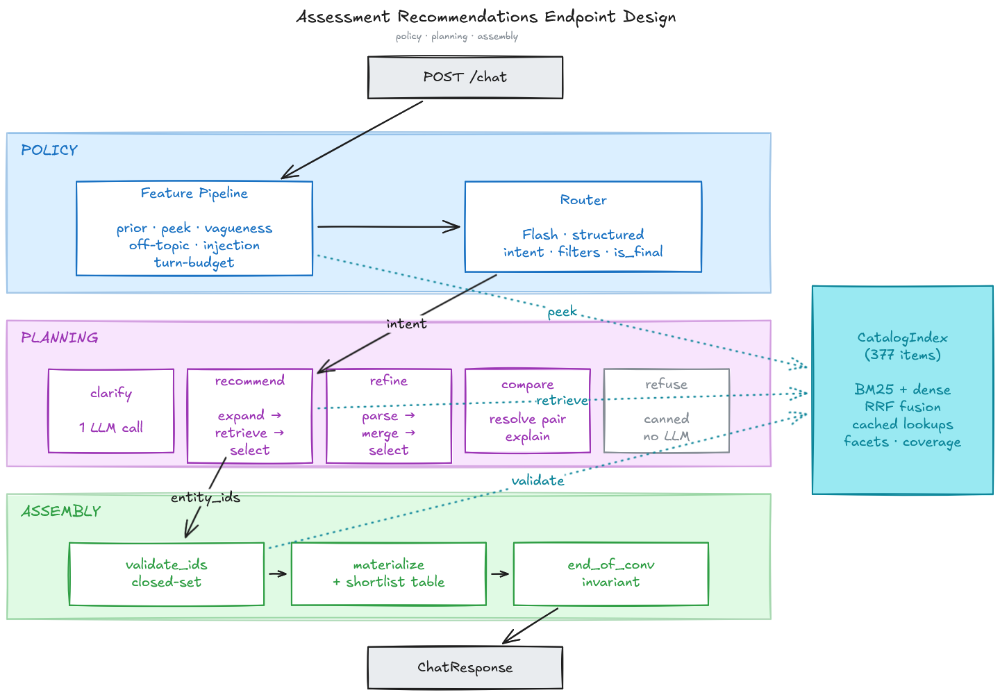

# SHL Assessment Recommender

A conversational FastAPI agent that takes a hiring manager from a vague intent ("I'm hiring a Java developer") to a grounded shortlist of SHL assessments through dialogue. Built on Google Gemini (Vertex AI) with a hybrid policy / planning / safety architecture.

The submission endpoint exposes:

- `GET /health` → readiness gate, returns `{"status": "ok"}` only when the catalog index is loaded.
- `POST /chat` → stateless conversational endpoint. Accepts the full conversation history and returns the next reply plus, when appropriate, a structured shortlist of 1–10 assessments.

---

## Architecture (in 30 seconds)



Three layers, top to bottom:

- **Policy** — deterministic feature pipeline + a single structured-output Router call. Emits `{intent, search_query, filters, coverage_letters, compare_pair, refuse_*, constraint_deltas, is_final}`.
- **Planning** — five per-intent handlers: `recommend` / `refine` / `compare` run a candidate-pool selection LLM; `clarify` is one Flash call; `refuse` is a canned template with no LLM.
- **Assembly** — closed-set `validate_ids` → `materialize` → `end_of_conversation` invariant → `ChatResponse` with an embedded markdown shortlist table.

`CatalogIndex` (377 items, BM25 + dense + cached lookups) is the shared store touched by all three layers.

The full architectural rationale (what was rejected, why) lives in [`design-decisions.md`](./design-decisions.md). The vertical-slice plan that produced the code is in [`IMPLEMENTATION-CHECKLIST.md`](./IMPLEMENTATION-CHECKLIST.md).

### Why this shape

- **Hard guarantees stay structural.** Schema compliance, no-recommend-on-vague-turn-1, no-end-without-shortlist, catalog-only URLs — all enforced by Python in policy / safety layers. The model literally cannot violate them.
- **Agency lives where it pays.** Inside `recommend`/`refine`/`compare`, Gemini reasons over a closed candidate pool to pick the final shortlist. The selection call IS the reranker.
- **Hybrid retrieval + deterministic alias expansion.** BM25 + dense (`gemini-embedding-001` @ 768 dims, Matryoshka) fused via RRF (k=60), with hard facet pre-filters, category-coverage candidate injection (diversity-aware along the `test_type` axis), and a catalog-side alias-expansion layer (`catalog/query_expansion.py`) that promotes high-confidence items by acronym / parenthetical / skill-token match before LLM selection. See `design-decisions.md` §5b for the metric-fitting disclosure on the concept-rule half of that layer.

---

## Live verified results

Run on the 10 personas in `sample_conversations/` against the real Gemini API (catalog of 377 SHL Individual Test Solutions, AI Studio endpoint):

| Metric | Value |
|---|---|
| Mean Recall@10 | **0.98** |
| Schema valid | **1.0** (every turn, every persona) |
| Behavior probes | **7/7 pass** (`scripts/probes_live.py`) |
| Unit + integration + replay tests | **112/112 pass** |

Reproduce with `uv run python scripts/replay_live.py` (writes JSONL to `data/replay_runs/`).

⚠️ These numbers describe sample-replay behavior. The deterministic concept rules in `catalog/query_expansion.py` were curated around the visible hiring scenarios; held-out generalization is unverified. See `design-decisions.md` §5b for the full disclosure.

---

## Repo layout

```
src/shl_recommender/
├── main.py                  # FastAPI app: /health, /chat, lifespan
├── schemas.py               # Pydantic v2 API request/response
├── config.py                # Env-driven Settings (models, temperatures, dims)
├── catalog/
│   ├── normalize.py         # JSON → CatalogItem; test_type letter derivation
│   ├── loader.py            # CatalogIndex (items, BM25, embeddings, coverage)
│   ├── retrieval.py         # Hybrid retrieval + RRF + filters + coverage
│   └── query_expansion.py   # Catalog-derived aliases + domain concept rules
├── features/
│   └── pipeline.py          # Pre-router feature bundle
├── agent/
│   ├── llm.py               # google-genai wrapper, Vertex auth, async, retries
│   ├── prompts.py           # All prompt templates (one place to tune)
│   ├── router.py            # Policy layer — structured output
│   ├── tools.py             # Catalog tool utilities + function declarations
│   ├── runner.py            # Agent orchestrator (features → router → handler)
│   └── handlers/            # clarify / recommend / refine / compare / refuse
├── assembly/
│   ├── validator.py         # Closed-set ID validation, materialization
│   └── reply.py             # Markdown table + end_of_conversation invariant
└── observability/
    └── logging.py           # structlog → stdout (Cloud Logging-compatible)

scripts/
├── build_index.py           # Normalize catalog → embed → BM25 → save artifacts
├── replay_live.py           # Live replay against the real LLM (Recall@10)
└── probes_live.py           # Live behavior probes against the real LLM

tests/
├── unit/                    # 90 unit tests
├── integration/             # 10 end-to-end with FakeLLMClient
└── replay/
    ├── personas.py          # Extract personas + labels from sample_conversations/
    ├── harness.py           # Recall@10 + schema validation loop
    └── probes.py            # Behavior probe suite (7 scripted/live probes)
```

---

## Quick start

### Prerequisites

- Python ≥ 3.11
- `uv` package manager (`pip install uv`)
- Either a GCP project with Vertex AI enabled, or a Google AI Studio API key.

### Local setup

```bash
# 1. Install dependencies
uv sync

# 2. Configure credentials — copy the template and fill in your values
cp .env.example .env
#    edit .env: set GCP_API_KEY=<your-key>  (or GOOGLE_CLOUD_PROJECT for Vertex)

# 3. Build the catalog index (placeholder embeddings without credentials)
uv run python scripts/build_index.py --dry-run

#    OR with real embeddings (uses .env automatically):
uv run python scripts/build_index.py

# 4. Run tests (all 112 should pass)
uv run pytest tests/

# 5. Start the service (.env auto-loaded)
uv run uvicorn shl_recommender.main:app --reload

# 6. Smoke test
curl http://localhost:8000/health
curl -X POST http://localhost:8000/chat \
     -H 'content-type: application/json' \
     -d '{"messages":[{"role":"user","content":"Hiring senior Java backend engineer with 5 years Spring, SQL, AWS"}]}'
```

**Auth modes** (set in `.env`):

| Mode | Env vars | Endpoint |
|---|---|---|
| Vertex AI w/ API key | `GOOGLE_CLOUD_PROJECT=…` + `GCP_API_KEY=…` | Vertex (`aiplatform.googleapis.com`) |
| Vertex AI w/ ADC | `GOOGLE_CLOUD_PROJECT=…` + `gcloud auth application-default login` | Vertex |
| Google AI Studio | `GCP_API_KEY=…` (no project) | Generative Language API |

`GOOGLE_API_KEY` and `GEMINI_API_KEY` are recognized as aliases for `GCP_API_KEY`.

### Live replay against samples

```bash
GOOGLE_CLOUD_PROJECT=<your-project> uv run python scripts/replay_live.py
```

Drives every `sample_conversations/C*.md` persona through the live agent and prints per-trace Recall@10.

### Live behavior probes

```bash
GOOGLE_CLOUD_PROJECT=<your-project> uv run python scripts/probes_live.py
```

---

## API contract

### `POST /chat`

**Request**:

```json
{
  "messages": [
    {"role": "user", "content": "Hiring a Java developer who works with stakeholders"},
    {"role": "assistant", "content": "Sure. What is seniority level?"},
    {"role": "user", "content": "Mid-level, around 4 years"}
  ]
}
```

**Response**:

```json
{
  "reply": "Got it. Here are 5 assessments that fit a mid-level Java dev with stakeholder needs.\n\n| # | Name | ... |",
  "recommendations": [
    {"name": "Java 8 (New)", "url": "https://www.shl.com/...", "test_type": "K"},
    {"name": "OPQ32r",       "url": "https://www.shl.com/...", "test_type": "P"}
  ],
  "end_of_conversation": false
}
```

**Invariants enforced server-side:**
- Every URL is a real catalog URL.
- `recommendations` is empty on `clarify` / `refuse` turns; 1–10 items on commit/refine turns.
- `end_of_conversation` is `true` only when the user is confirming AND a shortlist exists (or is being committed this turn).

---

## Deployment to Cloud Run

```bash
# One-time setup
gcloud config set project <your-project>
gcloud services enable aiplatform.googleapis.com run.googleapis.com cloudbuild.googleapis.com
gcloud projects add-iam-policy-binding <your-project> \
    --member=serviceAccount:<your-project-number>-compute@developer.gserviceaccount.com \
    --role=roles/aiplatform.user

# Deploy (builds the image with --source which uses the Dockerfile)
gcloud run deploy shl-recommender \
    --source . \
    --region us-central1 \
    --memory 512Mi --cpu 1 \
    --concurrency 80 \
    --min-instances 0 --max-instances 4 \
    --allow-unauthenticated \
    --set-env-vars GOOGLE_CLOUD_PROJECT=<your-project>,GOOGLE_CLOUD_LOCATION=us-central1
```

The Dockerfile does **not** rebuild embeddings. It copies the existing `data/build/*` artifacts into the image. Run `uv run python scripts/build_index.py` before deployment for real embeddings, or `uv run python scripts/build_index.py --dry-run` only when you intentionally want placeholder vectors for API-shape testing. If `data/build` is missing, the Docker build fails.

---

## Models & retrieval (env-driven; defaults match the locked design)

Every model name and sampling temperature is sourced from `.env` via
`src/shl_recommender/config.py`. The defaults below are applied when no override
is set. See `.env.example` for the full list.

| Concern | Default | Env var |
|---|---|---|
| Router | `gemini-2.5-flash` @ temp 0.0 | `SHL_ROUTER_MODEL` / `SHL_ROUTER_TEMPERATURE` |
| Recommend selection | `gemini-2.5-flash` @ temp 0.1 | `SHL_HANDLER_MODEL` / `SHL_RECOMMEND_TEMPERATURE` |
| Refine selection | `gemini-2.5-flash` @ temp 0.1 | `SHL_HANDLER_MODEL` / `SHL_REFINE_TEMPERATURE` |
| Compare | `gemini-2.5-flash` @ temp 0.2 | `SHL_HANDLER_MODEL` / `SHL_COMPARE_TEMPERATURE` |
| Clarify | `gemini-2.5-flash` @ temp 0.3 | `SHL_HANDLER_MODEL` / `SHL_CLARIFY_TEMPERATURE` |
| Refuse / End | None (canned text) | — |
| Embeddings | `gemini-embedding-001` @ 768 dims | `SHL_EMBEDDING_MODEL` / `SHL_EMBEDDING_DIMS` |
| Top-p (all calls) | 0.95 | `SHL_TOP_P` |
| Embed batch size | 32 | `SHL_EMBEDDING_BATCH_SIZE` |
| Per-call LLM timeout | 10s | `SHL_LLM_TIMEOUT_SECONDS` |
| Whole `/chat` timeout | 28s | `SHL_REQUEST_TIMEOUT_SECONDS` |
| Lexical retrieval | `rank-bm25`, BM25Okapi | hardcoded |
| Vector index | numpy in-memory cosine (377 items) | hardcoded |
| Fusion | RRF (k=60) | hardcoded |
| Reranker | None (selection LLM serves as reranker) | — |
| Query expansion | Catalog-derived aliases + 10 domain concept rules (`catalog/query_expansion.py`) | — |
| Gemini thinking | Disabled (`ThinkingConfig(thinking_budget=0)`) so JSON output budget isn't spent on hidden thinking | hardcoded |
| Gemini AFC | Disabled (`AutomaticFunctionCallingConfig(disable=True)`) so SDK never auto-invokes Python callables | hardcoded |
| Response schema sanitizer | `pydantic_to_gemini_schema()` strips `additionalProperties` / `$defs` / `default`, inlines `$ref`, converts optional `anyOf` to `nullable:true` — works on Vertex AI and AI Studio | hardcoded |

Changing `SHL_EMBEDDING_DIMS` requires rebuilding `data/build/*`; startup fails fast if the baked embedding matrix and runtime setting disagree.

---

## Observability

Structured JSON logs to stdout — Cloud Logging auto-ingests with field-level indexing.

Per-request fields:

```json
{
  "request_id": "...",
  "turn_index": 3,
  "intent": "refine",
  "is_final_turn": false,
  "recommendations_count": 5,
  "end_of_conversation": false,
  "fallbacks_triggered": [],
  "validation_errors": [],
  "retrieval": {"candidates_after_filter": 18, "coverage_letters": ["P", "A"]},
  "llm_calls": {"count": 3, "tokens_in": 4120, "tokens_out": 380, "models": ["gemini-2.5-flash"], "timeouts": 0},
  "timings": {"features_ms": 18, "router_ms": 720, "handler_ms": 2010, "assembly_ms": 12, "total_ms": 2842},
  "severity": "INFO",
  "timestamp": "2026-05-09T22:30:00Z"
}
```

---

## Tests

```bash
uv run pytest tests/                          # all 112 tests
uv run pytest tests/unit/                     # fast — under 5s
uv run pytest tests/integration/              # FakeLLMClient end-to-end
uv run pytest tests/replay/                   # persona harness + scripted probes
```

Test layers:
- **Unit (88)** — pure functions (normalize, retrieval math, validators, features, env-driven config, reply assembly, request-schema hardening, query-expansion alias/concept matching).
- **Integration (10)** — full `/chat` round-trips with `FakeLLMClient`. Schema validation on every turn. Edge cases: hallucinated IDs dropped, refine drop-X removes-X, compare uses both records, FastAPI HTTP path.
- **Replay (12)** — persona extraction from samples, scripted Recall@10 smoke, and 7 behavior probes (turn-1-vagueness, injection, off-topic, hallucination guard, refuse-never-ends, no-end-without-shortlist tightened to require both `end=False` AND empty recommendations, catalog-only URLs).

Live replay (`scripts/replay_live.py`) and live probes (`scripts/probes_live.py`) are run manually — they cost API tokens.

---

## Failure-mode handling

| Failure mode | Strategy |
|---|---|
| Retrieval returns 0 candidates | Relax filters: `duration_max` → `languages` → `test_types` → `job_levels` → `remote_only`+`adaptive_only`. If still empty, return a constraint-relax prompt. |
| Selection LLM emits non-catalog IDs | Validator drops them. ≥1 valid → emit those. 0 valid → fall back to top-K of retrieval by score. |
| Selection LLM returns truncated/invalid JSON | **JSON salvage** regex-extracts `"\d+"` substrings, keeps only IDs in the closed candidate pool, emits those with a `salvaged_ids_from_invalid_json` flag. Closed-set guarantee preserved. |
| LLM call timeout / 5xx | Per-call deadline via `SHL_LLM_TIMEOUT_SECONDS` (default 10s) + Tenacity exponential backoff (multiplier 0.3, max 2.0s, 3 attempts), bounded by the whole-request deadline `SHL_REQUEST_TIMEOUT_SECONDS` (default 28s). Total failure → handler-specific fallback. |
| Compare target not in catalog | RapidFuzz `WRatio ≥ 85` fuzzy match. No match → "X isn't in the SHL catalog — did you mean [closest]?" |
| Router LLM call fails | Deterministic heuristic fallback (`heuristic_decision` in `agent/router.py`). |

---

## License & credits

Built for the SHL Labs assessment. Catalog data scraped from the SHL public product catalog (Individual Test Solutions). Conversational personas extracted from `sample_conversations/`.
